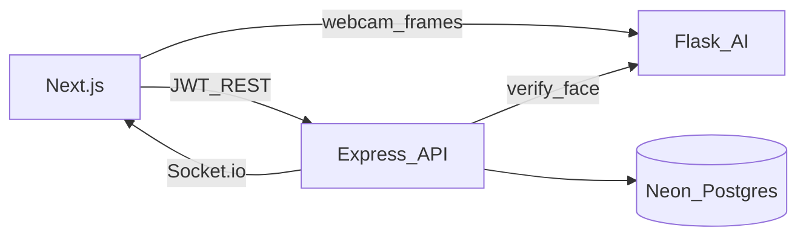

# SecureVote AI: Folder Structure, Backend, and Initial Schema

## Context

The workspace at `[c:\Users\Fagun\Desktop\New folder (8)](c:\Users\Fagun\Desktop\New folder (8)`) is **empty**. This plan covers only the three items you asked to generate first: **folder structure**, **Express + Neon backend setup**, and **initial database schema**. The layout is chosen so Socket.io, JWT auth, blockchain service, Flask AI, and Next.js can plug in without reshaping the repo.

## 1. Monorepo folder structure

Use a **single repository** with clear app boundaries (no framework lock-in for DB migrations):

```text
securevote-ai/
├── package.json                 # npm workspaces root (optional scripts: dev:api, dev:web)
├── README.md                    # Setup: env vars, Neon, Python venv, run order
├── .env.example                 # Document all required keys (never commit secrets)
├── .gitignore
├── apps/
│   ├── web/                     # Next.js (App Router) + Tailwind + react-webcam + chart.js
│   │   ├── package.json
│   │   ├── next.config.ts
│   │   ├── tailwind.config.ts
│   │   ├── tsconfig.json
│   │   └── src/app/             # login, register, vote, admin, analytics
│   ├── api/                     # Express + TypeScript + Socket.io
│   │   ├── package.json
│   │   ├── tsconfig.json
│   │   └── src/
│   │       ├── index.ts         # HTTP server + Socket.io attach
│   │       ├── app.ts           # Express app factory
│   │       ├── config/          # env validation (e.g. zod)
│   │       ├── db/              # Neon pool + migrations runner hook
│   │       ├── routes/
│   │       ├── controllers/
│   │       ├── services/        # auth, voting, blockchain, election, audit
│   │       ├── middleware/      # jwt, rbac, rate-limit hooks
│   │       ├── socket/          # admin dashboard namespaces + auth
│   │       └── blockchain/      # Block class, chain validation, persistence
│   └── ai-service/              # Python Flask
│       ├── requirements.txt     # flask, face_recognition, opencv-python-headless, ...
│       ├── app.py               # /encode-face, /match-face, /detect-blink
│       └── README.md            # Model/camera notes for Windows
├── packages/
│   └── shared/                  # Optional: shared TS types/constants for API contracts
│       ├── package.json
│       └── src/index.ts
└── infra/
    └── sql/
        └── 001_initial_schema.sql   # Initial Neon schema (see section 3)
```

**Rationale:** `apps/api` owns persistence and business rules; `infra/sql` keeps migrations versioned and runnable against Neon from CI or local `psql`. Next.js and Flask stay thin clients of the API except where the browser must talk to Flask for webcam frames (typically **API proxies to Flask** or **direct Flask URL** with CORS locked to the web origin—decide in implementation and document in README).

## 2. Backend setup: Express + Neon

### Dependencies (conceptual)

- **Runtime:** `express`, `cors`, `helmet`, `express-rate-limit`, `jsonwebtoken`, `bcrypt`, `socket.io`
- **DB:** `pg` (node-postgres) with a **singleton pool**; for serverless-friendly Neon you can optionally use `@neondatabase/serverless`—for a long-lived Express process, `**pg.Pool` + Neon connection string** is standard and production-proven
- **Validation:** `zod` for env and request bodies
- **Crypto:** Node `crypto` for AES-256-GCM (vote encryption) and SHA-256 (blockchain); store **AES key** in env (`VOTE_ENCRYPTION_KEY` as 32-byte base64 or hex)

### Environment variables (minimum for bootstrap)


| Variable              | Purpose                                          |
| --------------------- | ------------------------------------------------ |
| `DATABASE_URL`        | Neon PostgreSQL connection string (SSL required) |
| `JWT_SECRET`          | Sign access tokens                               |
| `JWT_EXPIRES_IN`      | e.g. `15m` / `1h`                                |
| `VOTE_ENCRYPTION_KEY` | AES key for `votes.encrypted_vote`               |
| `AI_SERVICE_URL`      | Flask base URL (e.g. `http://127.0.0.1:5001`)    |
| `CORS_ORIGIN`         | Next.js origin                                   |
| `PORT`                | API port (e.g. `4000`)                           |


### Connection pattern

- `**apps/api/src/db/pool.ts`:** create `new Pool({ connectionString: process.env.DATABASE_URL, ssl: { rejectUnauthorized: true } })` (Neon requires TLS; align `ssl` with Neon docs for your driver version).
- `**apps/api/src/db/migrate.ts` (optional later):** read `infra/sql/*.sql` and apply in order, or use `node-pg-migrate` / manual `psql` in README.
- **Health route:** `GET /health` returns DB ping (`SELECT 1`) for ops.

### Express layout (clean architecture)

- `**app.ts`:** middleware stack (helmet, cors, json limit, error handler).
- `**routes/*`:** thin—delegate to controllers.
- `**controllers/*`:** HTTP in/out only.
- `**services/*`:** business logic (no `req`/`res`), async/await throughout.
- **Global error handler:** map known errors to status codes; log server-side.

Socket.io will attach to the **same HTTP server** in `index.ts` after `app` is created; admin JWT verification on connection for the dashboard namespace (implementation in a follow-up task).

## 3. Initial database schema (Neon / PostgreSQL)

Single migration file, e.g. `[infra/sql/001_initial_schema.sql](infra/sql/001_initial_schema.sql)`, implementing your required tables with **constraints and indexes** suitable for production.

### Design decisions (aligned with your spec)

- `**users.face_encoding`:** `BYTEA` or `TEXT` (base64). `face_recognition` encodings are float vectors—store as **JSONB array of numbers** or **BYTEA**; JSONB is easy to debug and version.
- `**users.has_voted`:** boolean; enforce **one vote** with a unique partial index on `votes(user_id)` or rely on `has_voted` + transaction (prefer **UNIQUE (user_id)** on votes).
- `**votes.encrypted_vote`:** `TEXT` or `BYTEA` storing AES-GCM ciphertext + IV (concatenated or JSON); document format in code comments.
- `**candidates.vote_count`:** maintain via transaction with vote insert, or derive from `votes` in analytics; your spec includes the column—use a **trigger or service-layer update** to keep it consistent (add in services layer).
- `**blockchain`:** one row per block; `**index` UNIQUE**; store `timestamp` as `TIMESTAMPTZ`.
- `**election`:** single active row pattern—**partial unique index** `WHERE is_active = true` so only one active election, or enforce in application code; index recommended.
- `**logs`:** index on `(timestamp)`, `(user_id)`, `(action)` for audit queries.

### Core SQL outline (tables and keys)

- `**users`:** `id UUID PRIMARY KEY DEFAULT gen_random_uuid()`, `name`, `email UNIQUE NOT NULL`, `password` (bcrypt hash), `role` CHECK (`voter`  `admin`  `super_admin`), `has_voted BOOLEAN DEFAULT FALSE`, `face_encoding JSONB`, `created_at`, `updated_at`.
- `**candidates`:** `id SERIAL` or UUID, `name`, `party`, `vote_count INTEGER DEFAULT 0`.
- `**votes`:** `id`, `user_id` REFERENCES `users` **UNIQUE**, `candidate_id` REFERENCES `candidates`, `encrypted_vote`, `ip INET` or `TEXT`, `timestamp TIMESTAMPTZ DEFAULT now()`.
- `**blockchain`:** columns exactly as specified; `index` UNIQUE; FK to nothing (immutable log); optional FK from `votes` to `blockchain` if you store `block_id` on vote—optional for traceability.
- `**election`:** `start_time`, `end_time`, `is_active BOOLEAN`.
- `**logs`:** `user_id` nullable (failed login), `action`, `ip`, `timestamp`.

Add **indexes:** `votes(candidate_id)`, `logs(user_id, timestamp)`, `blockchain(index)`.

### Fraud / duplicate IP (schema support)

- Add table `**vote_ip_stats`** or use `**logs`** + queries; minimal approach: `**votes`** already has `ip`—add **index on `ip`** and enforce “suspicious” in service when `COUNT(*) > 1` for same `ip` in active election (log to `logs`).

## 4. How this connects to the rest of the system (later phases)




- **Auth flow:** Register captures face → Flask `/encode-face` → store encoding; Login → blink via `/detect-blick` → match via `/match-face` → API issues JWT.
- **Vote flow:** API checks election window + `has_voted` → encrypt vote → insert `votes` → append **blockchain row** → update `has_voted` + `candidates.vote_count` in one transaction → audit `logs` → Socket.io broadcast to admins.

## 5. README (first milestone)

Document: Node version, `npm install` at root and per app, `DATABASE_URL` from Neon console, run `psql` or migration against Neon, start order: **Neon → Flask → API → Web**, and copy `.env.example` to `.env` files per app.

## 6. Implementation order (after plan approval)

1. Scaffold monorepo folders and root `package.json` workspaces.
2. Add `infra/sql/001_initial_schema.sql` and verify against Neon.
3. Implement `apps/api` minimal server: env validation, `pg` pool, `/health`, CORS.
4. Expand routes/services (auth, voting, blockchain) and `apps/web` / `apps/ai-service` per your full spec in subsequent commits.

